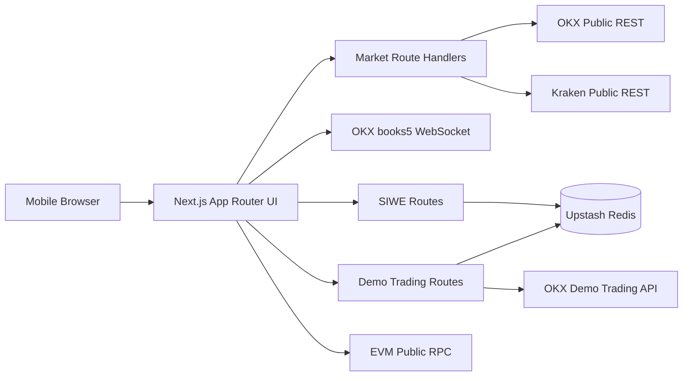

# Apex Ledger H5

[简体中文](./README.md) | [English](./README.en.md)

A mobile-first Web3 paper-trading platform that brings together live public market data, official OKX Demo Trading, wallet connectivity, SIWE authentication, order management, and read-only on-chain assets in one complete H5 product.

> This is a paper-trading project. It does not custody assets, initiate on-chain transfers, or place orders with real funds.

[Live Demo](https://apex-ledger-h5.vercel.app) · [Technical Design](./docs/technical-design.md) · [Design Handoff](./docs/design-handoff.md)

## Product Preview

<table>
  <tr>
    <td align="center"><strong>Market Discovery</strong></td>
    <td align="center"><strong>Live Market and Paper Trading</strong></td>
  </tr>
  <tr>
    <td></td>
    <td></td>
  </tr>
</table>

## Highlights

### Live Markets and Trading Terminal

- OKX Public REST supplies tickers, candles, and instrument metadata, with Kraken as a public fallback.
- The OKX `books5` WebSocket channel streams a live five-level order book through a dedicated reconnecting and validating client.
- Lightweight Charts renders responsive candlesticks with interval switching, crosshair, drag, and zoom interactions.
- Market rows explicitly identify `OKX LIVE`, `KRAKEN LIVE`, `MIXED DATA`, or `DEMO` results.

### Official OKX Demo Trading

- Private orders are hard-locked to OKX Demo Trading with `x-simulated-trading: 1`.
- BTC, ETH, and SOL flows support limit orders, market orders, order lookup, fills, and cancellation.
- Server-side controls cover access authorization, same-origin enforcement, rate limits, precision, notional limits, and idempotency.
- Orders belong to an anonymous visitor or an authenticated SIWE wallet owner; anonymous workspaces migrate idempotently after sign-in.

### Wallet Identity and Read-only Assets

- Reown AppKit, WalletConnect, wagmi, and viem provide EVM wallet connectivity and network switching.
- SIWE verifies address ownership with one-time nonces, expiry, domain/URI binding, and server-side signature verification.
- Supported networks are Ethereum, Base, Arbitrum One, and BNB Smart Chain.
- The app reads only the active network's native asset and allowlisted stablecoins. It does not scan arbitrary tokens or aggregate balances across chains.

### Dual-ledger Portfolio

| Ledger | Source | Purpose | Real assets |
| --- | --- | --- | --- |
| OKX Demo | Private OKX Demo API | Paper orders, holds, and fills | No |
| On-chain | Public EVM RPC | Public wallet balances | Yes, read-only |

The two balances are never merged and never authorize each other. RPC failures do not clear Demo balances, and OKX Demo failures do not hide on-chain wallet data.

## Architecture



| Layer | Responsibility | Key paths |
| --- | --- | --- |
| UI | H5 screens, trading components, charts, and interaction state | `src/app`, `src/components`, `src/features` |
| Market data | Upstream adapters, normalization, fallback, and caching | `src/lib/market-data`, `src/app/api/market` |
| Paper trading | OKX Demo signing, order service, and risk boundaries | `src/lib/okx-demo`, `src/app/api/demo` |
| Identity | SIWE, sessions, and owner workspaces | `src/features/auth`, `src/server/auth`, `src/server/identity` |
| Web3 | Networks, token allowlists, and read-only balances | `src/lib/web3`, `src/features/wallet` |

## Identity and Authorization Boundaries

```text
Wallet connected  !=  SIWE authenticated  !=  Demo trading authorized
```

1. `connected`: the browser receives only a public address and active network.
2. `authenticated`: the user signs a readable SIWE message and receives an HttpOnly session after server verification.
3. `demoAuthorized`: a separate Demo access code issues the Demo Trading gate cookie.

The client contains no `sendTransaction`, `writeContract`, token approval, or private-key access flow. SIWE does not consume gas or authorize trading.

## Safety and Risk Controls

- OKX credentials, the session secret, and Redis credentials remain server-only.
- The Demo API client has no runtime option for switching to live trading.
- Per-visitor open-order counts, per-order notional, and global daily activity are bounded.
- Write routes enforce same-origin checks, rate limits, `Idempotency-Key`, and order ownership.
- Market-order reference prices are loaded again by the server instead of trusting browser input.
- Wallet RPC, market data, and OKX Demo are separate error domains; the UI never labels fixture data as live.

## Technology

- Next.js 16, React 19, TypeScript, Tailwind CSS v4
- Reown AppKit, WalletConnect, wagmi, viem, SIWE
- Lightweight Charts, TanStack Query, Decimal.js, Zod
- OKX API V5, Kraken Public API, Upstash Redis
- Vitest, Testing Library, ESLint, Vercel

## Routes

| Route | Purpose |
| --- | --- |
| `/markets` | Market overview, categories, and remote search |
| `/trade/[pair]` | Candles, live order book, and order entry |
| `/trade/[pair]/confirm` | Order confirmation and Demo access gate |
| `/orders` | Open orders, history, and fills |
| `/portfolio` | OKX Demo and on-chain dual-ledger portfolio |
| `/connect-wallet` | Wallet connection and SIWE sign-in |
| `/settings` | Wallet, session, and Demo authorization controls |

## Project Structure

```text
src/
├── app/          # Page routes and same-origin APIs
├── components/   # Layout, market, and trading UI
├── features/     # Identity, wallet, and asset features
├── lib/          # Market, Demo Trading, and Web3 adapters
└── server/       # SIWE, sessions, and owner workspaces
docs/             # Technical design documentation
```

See [`docs/technical-design.md`](./docs/technical-design.md) and [`docs/superpowers/specs`](./docs/superpowers/specs) for detailed architecture decisions.

## Local Development

Node.js 20+ is recommended.

```bash
npm install
cp .env.example .env.local
npm run dev
```

Open `http://127.0.0.1:3000`. The root route enters `/markets`.

### Environment Variables

| Variable | Exposure | Purpose |
| --- | --- | --- |
| `TRADING_PROFILE` | Server | Must remain `okx_demo` |
| `OKX_DEMO_API_KEY` | Secret | OKX Demo API key |
| `OKX_DEMO_SECRET_KEY` | Secret | OKX Demo secret |
| `OKX_DEMO_PASSPHRASE` | Secret | OKX Demo passphrase |
| `DEMO_ACCESS_CODE` | Secret | Demo access code |
| `SESSION_SECRET` | Secret | Session signing secret |
| `UPSTASH_REDIS_REST_URL` | Secret | Redis REST endpoint |
| `UPSTASH_REDIS_REST_TOKEN` | Secret | Redis REST token |
| `NEXT_PUBLIC_REOWN_PROJECT_ID` | Public | Reown Cloud project ID |
| `NEXT_PUBLIC_APP_URL` | Public | Canonical application origin |
| `OKX_API_BASE_URL` | Optional | Reachable OKX-compatible public market gateway |

If private Demo configuration is incomplete, affected routes fail closed with `503` instead of fabricating fills.

## Quality Checks

```bash
npm test
npm run lint
npm run typecheck
npm run build
```

The suite covers market normalization, order services, authentication, risk rules, wallet balances, and major UI states.

## Deployment

The application is deployed on Vercel. A production environment must:

1. Configure the variables documented in `.env.example`.
2. Allowlist the production and local origins in Reown Cloud.
3. Set `NEXT_PUBLIC_APP_URL` to `https://apex-ledger-h5.vercel.app`.
4. Verify wallet connection, SIWE, Demo orders, cancellation, and ledger isolation in Preview before promotion.

## Roadmap

- [x] Live market data, candlesticks, and WebSocket order book
- [x] OKX Demo Trading and full order lifecycle management
- [x] Wallet connectivity, SIWE, and multi-chain read-only assets
- [ ] Shared Monorepo packages and a React Native client
- [ ] MCP server for market, account, and order-draft tools
- [ ] AI agent for natural-language market Q&A and controlled order generation
- [ ] Cross-chain portfolio aggregation

The MCP and AI layers will reuse the existing domain services. Every order write will continue to require parameter validation, authorization controls, and explicit user confirmation.

## References

- [OKX API V5](https://app.okx.com/docs-v5/en/)
- [Kraken REST API](https://docs.kraken.com/api/)
- [ERC-4361: Sign-In with Ethereum](https://eips.ethereum.org/EIPS/eip-4361)
- [Reown AppKit](https://docs.reown.com/appkit/overview)
- [wagmi](https://wagmi.sh/)
- [viem](https://viem.sh/)
- [Lightweight Charts](https://tradingview.github.io/lightweight-charts/)
