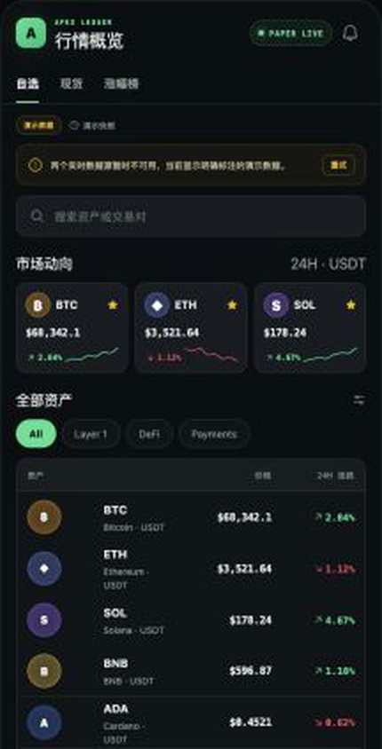
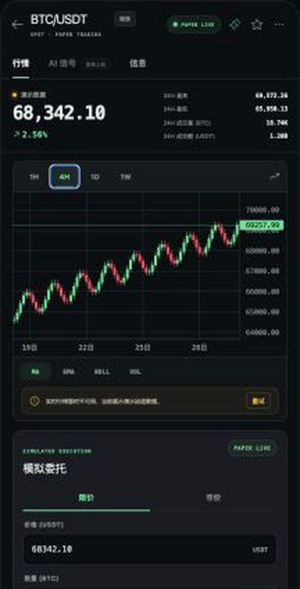
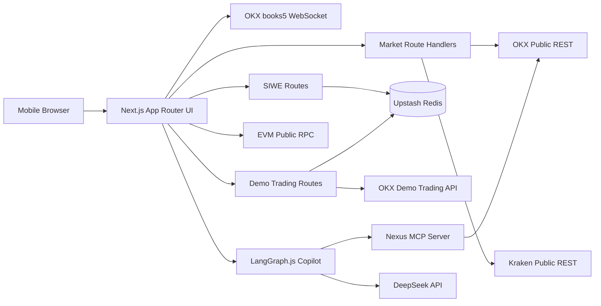

# Apex Ledger H5

[简体中文](./README.md) | [English](./README.en.md)

面向移动端的 Web3 模拟交易平台：将公开实时行情、OKX 官方 Demo Trading、钱包连接、SIWE 登录、订单管理与链上只读资产整合为一套完整的 H5 产品闭环。

> 这是模拟交易项目，不托管真实资产，不发起链上转账，也不会使用真实资金下单。

[在线体验](https://apex-ledger-h5.vercel.app) · [技术方案](./docs/technical-design.md) · [设计交付](./docs/design-handoff.md)

## 产品预览

<table>
  <tr>
    <td align="center"><strong>市场与资产发现</strong></td>
    <td align="center"><strong>实时行情与模拟交易</strong></td>
  </tr>
  <tr>
    <td></td>
    <td></td>
  </tr>
</table>

## 核心能力

### 实时市场与交易终端

- OKX Public REST 提供 ticker、K 线和市场信息，Kraken 作为公开行情回退源。
- OKX `books5` WebSocket 推送实时五档订单簿；断线、重连和数据校验由独立客户端处理。
- Lightweight Charts 渲染响应式蜡烛图，支持周期切换、十字线、拖动和缩放。
- 市场页覆盖多个 USDT 现货市场，并明确标识 `OKX LIVE`、`KRAKEN LIVE`、`MIXED DATA` 或 `DEMO`。

### OKX 官方 Demo Trading

- 下单请求只进入 OKX 官方模拟盘，私有客户端固定携带 `x-simulated-trading: 1`。
- 支持 BTC/ETH/SOL 的限价单、市价单、订单查询、成交记录和撤单。
- 服务端执行访问门禁、同源检查、限流、精度校验、名义金额限制和幂等控制。
- 订单按匿名访客或 SIWE 钱包 owner 隔离；钱包登录后可幂等迁移匿名订单工作区。

### 钱包身份与链上只读资产

- Reown AppKit、WalletConnect、wagmi 与 viem 负责 EVM 钱包连接和网络切换。
- SIWE 使用一次性 nonce、过期时间、domain/URI 绑定和服务端验签证明地址所有权。
- 支持 Ethereum、Base、Arbitrum One 和 BNB Smart Chain。
- 当前网络下只读取原生币与白名单稳定币余额；不扫描任意 Token，也不做跨链资产汇总。

### 双账本资产模型

| 账本 | 数据源 | 用途 | 是否真实资产 |
| --- | --- | --- | --- |
| OKX Demo | OKX Demo 私有 API | 模拟下单、冻结和成交 | 否 |
| On-chain | EVM Public RPC | 当前钱包公开余额 | 是，只读 |

两类余额从不合并，也不会互相授权。RPC 故障不会清空 Demo 余额，OKX Demo 故障也不会影响链上钱包展示。

### AI Market Copilot

- 交易页展示行情偏向、关键动因、主要风险、数据质量和 OKX 来源时间，并提供自然语言追问。
- LangGraph.js 用显式节点完成意图识别、证据收集与回答生成；MCP 负责受控工具调用，DeepSeek 只解释经过校验的数据。
- 趋势、波动率、量能、24 小时区间位置与盘口失衡在 MCP 层确定性计算，不让模型虚构数值。
- 模型未配置或调用失败时回退为规则分析；MCP 整体不可用时仅降级 AI 卡片，不影响行情、钱包和 Demo Trading。

## 技术架构



| 层级 | 主要职责 | 关键目录 |
| --- | --- | --- |
| UI | H5 页面、交易组件、图表和交互状态 | `src/app`、`src/components`、`src/features` |
| 市场数据 | 上游适配、响应归一化、回退和缓存 | `src/lib/market-data`、`src/app/api/market` |
| 模拟交易 | OKX Demo 签名、订单服务与风险边界 | `src/lib/okx-demo`、`src/app/api/demo` |
| 身份与权限 | SIWE、Session、owner 工作区 | `src/features/auth`、`src/server/auth`、`src/server/identity` |
| Web3 | 网络、Token 白名单与只读余额 | `src/lib/web3`、`src/features/wallet` |
| AI Agent | LangGraph 编排、模型适配、MCP 工具与确定性降级 | `src/server/ai`、`src/lib/ai`、`src/features/ai` |

## 身份与权限边界

```text
Wallet connected  ≠  SIWE authenticated  ≠  Demo trading authorized
```

1. `connected`：浏览器只获得公开钱包地址和当前网络。
2. `authenticated`：用户签署可读 SIWE 消息，服务端验签后创建 HttpOnly Session。
3. `demoAuthorized`：独立 Demo 访问码签发 Demo Trading 门禁 Cookie。

客户端没有 `sendTransaction`、`writeContract`、Token approval 或私钥读取逻辑。SIWE 签名不会产生 Gas，也不会授权交易。

## 安全与风险控制

- OKX API Key、Secret、Passphrase、Session Secret 和 Redis Token 只存在服务端环境变量中。
- Demo API 客户端没有切换到实盘交易的配置入口。
- 单访客未结订单数、单笔名义金额和全站每日交易量均有限制。
- 写接口执行同源校验、访问限流、`Idempotency-Key` 和订单归属验证。
- 市价单风险参考价由服务端重新读取，浏览器不能自行决定风控价格。
- 钱包 RPC、市场行情和 OKX Demo 是独立错误域，UI 不会把静态数据伪装成实时结果。

## 技术栈

- Next.js 16、React 19、TypeScript、Tailwind CSS v4
- Reown AppKit、WalletConnect、wagmi、viem、SIWE
- Lightweight Charts、TanStack Query、Decimal.js、Zod
- OKX API V5、Kraken Public API、Upstash Redis
- Vitest、Testing Library、ESLint、Vercel

## 路由

| 路由 | 功能 |
| --- | --- |
| `/markets` | 市场概览、分类和远程搜索 |
| `/trade/[pair]` | K 线、实时盘口和交易面板 |
| `/trade/[pair]/confirm` | 订单确认与 Demo 门禁 |
| `/orders` | 当前委托、历史订单和成交记录 |
| `/portfolio` | OKX Demo 与链上钱包双账本 |
| `/connect-wallet` | 钱包连接与 SIWE 登录 |
| `/settings` | 钱包、Session 和 Demo 门禁管理 |

## 项目目录

```text
src/
├── app/          # 页面路由与同源 API
├── components/   # 布局、市场和交易 UI
├── features/     # 身份、钱包与资产功能
├── lib/          # 行情、Demo Trading 与 Web3 适配层
└── server/       # SIWE、Session 与 owner 工作区
docs/             # 技术方案与设计文档
```

更完整的架构决策见 [`docs/technical-design.md`](./docs/technical-design.md) 和 [`docs/superpowers/specs`](./docs/superpowers/specs)。

## 本地运行

要求 Node.js 20+。

```bash
npm install
cp .env.example .env.local
npm run dev
```

打开 `http://127.0.0.1:3000`。根路由会进入 `/markets`。

### 环境变量

| 变量 | 类型 | 说明 |
| --- | --- | --- |
| `TRADING_PROFILE` | 服务端 | 必须为 `okx_demo` |
| `OKX_DEMO_API_KEY` | Secret | OKX Demo API Key |
| `OKX_DEMO_SECRET_KEY` | Secret | OKX Demo Secret |
| `OKX_DEMO_PASSPHRASE` | Secret | OKX Demo Passphrase |
| `DEMO_ACCESS_CODE` | Secret | Demo 访问码 |
| `SESSION_SECRET` | Secret | Session 签名密钥 |
| `UPSTASH_REDIS_REST_URL` | Secret | Redis REST 地址 |
| `UPSTASH_REDIS_REST_TOKEN` | Secret | Redis REST Token |
| `NEXT_PUBLIC_REOWN_PROJECT_ID` | 公开 | Reown Cloud Project ID |
| `NEXT_PUBLIC_APP_URL` | 公开 | 应用正式 Origin |
| `OKX_API_BASE_URL` | 可选 | 可访问的 OKX 兼容公开行情网关 |
| `NEXUS_MCP_URL` | 服务端 | Nexus Streamable HTTP MCP 地址 |
| `NEXUS_MCP_TOKEN` | Secret | 与 MCP 服务 `MCP_AUTH_TOKEN` 相同的 Bearer Token |
| `DEEPSEEK_API_KEY` | Secret/可选 | DeepSeek API Key；不配置时使用确定性降级分析 |
| `DEEPSEEK_BASE_URL` | 服务端/可选 | 默认 `https://api.deepseek.com` |
| `DEEPSEEK_MODEL` | 服务端/可选 | 默认 `deepseek-v4-flash` |

私有 Demo 配置不完整时，相关接口会安全返回 `503`，不会回退到伪造成交。

## 质量检查

```bash
npm test
npm run lint
npm run typecheck
npm run build
```

项目包含市场数据、订单服务、身份认证、风险规则、钱包余额和主要 UI 状态的自动化测试。

## 部署

项目部署在 Vercel。生产环境需要：

1. 配置 `.env.example` 中的生产环境变量。
2. 在 Reown Cloud 中加入生产域名和本地开发域名。
3. 将 `NEXT_PUBLIC_APP_URL` 设置为 `https://apex-ledger-h5.vercel.app`。
4. 先在 Preview 验证钱包连接、SIWE、Demo 下单、撤单和双账本隔离，再提升到 Production。

## Roadmap

- [x] 实时行情、K 线与 WebSocket 订单簿
- [x] OKX Demo Trading 与订单全生命周期管理
- [x] 钱包连接、SIWE 与多链只读资产
- [ ] Monorepo 共享业务包与 React Native 客户端
- [x] MCP Server：聚合行情上下文与可解释技术指标工具
- [x] AI Agent：LangGraph.js 行情洞察、风险解释与自然语言问答
- [ ] AI 订单草稿：只生成受控参数，仍由用户在确认页二次确认
- [ ] 跨链资产聚合

MCP 与 AI Agent 将复用现有领域服务。所有订单写操作仍需参数校验、权限限制和用户二次确认。

## 参考资料

- [OKX API V5](https://app.okx.com/docs-v5/en/)
- [Kraken REST API](https://docs.kraken.com/api/)
- [ERC-4361: Sign-In with Ethereum](https://eips.ethereum.org/EIPS/eip-4361)
- [Reown AppKit](https://docs.reown.com/appkit/overview)
- [wagmi](https://wagmi.sh/)
- [viem](https://viem.sh/)
- [Lightweight Charts](https://tradingview.github.io/lightweight-charts/)
